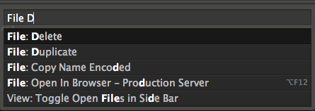
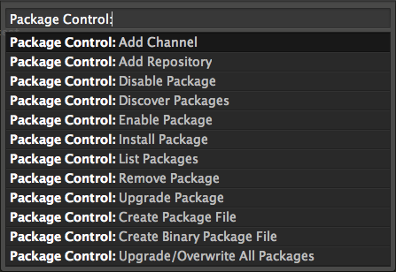

# Example Text

In the markdown file, the next paragraph uses normal MD syntax. It works without any additional changes.

At its core, Sublime Text 2 is a text editor. However, there are many features that make it stand out from the rest of the pack. These features include multiple cursors, a plugin system, and a few others which will be covered in this section.

The next section is just pure HTML, between raw tags (which might be useful when exporting from certain formats). Try to use Markdown where possible.

## 1. The Minimap



	The minimap is an innovative feature of Sublime Text 2 that allows you a bird's-eye view of the document you are editing. Always present at the right side of the editor, it allows you to quickly look at a live updated, zoomed out version of your current document. While the text will rarely be distinguishable, it allows for a topographical view of your document structure.

	

		
	

	The minimap is also very useful for navigating a large document as it can behave similar to a scroll bar. When clicked on, the minimap can be used to scroll the document to a different portion.

	However, should you find yourself not needing the minimap, or needed the screen real estate it inhabits, it can easily be hidden by using the menu bar to select
	<strong>View | Hide Minimap</strong>.

<h2>2. Multiple cursors</h2>

	Another way Sublime Text 2 differentiates itself from the crowded text editor market is by way of including functionality allowing the user to edit a document in multiple places at the same time. This can be very useful when making an identical change in multiple places. It is especially useful when the change that needs to occur could not be easily accomplished with find and replace. By pressing
	<strong>Command+Left Click</strong>, on OS X, or <strong>CTRL+Left Click</strong> on other platforms, an additional cursor will be placed at the location of the click. Each additional cursor will mirror the original cursor.

	The following screenshots demo this functionality. First, I created two additional cursors on each of my 3 lines of text. Then I proceeded to type test without quotes.

	

		
	

	Now, as shown in the second screenshot, anything typed will be typed identically on the three lines where the cursors were placed. In this case I typed a space followed by the word test. This addition was simultaneous and I only had to make the change once, after creating the additional cursors.

	

		
	

	To return to a single cursor, simply press
	<strong>Escape</strong> or left click anywhere on the document.

<h2>3. Goto Anything, Goto Symbol, Goto Line</h2>

	Sublime Text 2 makes it easy to navigate your projects and files with various goto features. These will be described in more detail in the following sections.

<h3>Goto Anything</h3>

	Goto Anything allows the user to display any open file quickly. By pressing
	<strong>Command+P</strong> on OS X, <strong>Ctrl+P</strong> on other platforms, a dialog will display a list of open files, including any files in a directory or subdirectory that was opened. This allows you to fuzzy search for a file name of any file. It can also be invoked from Goto menu item. Goto Anything is especially helpful when utilizing a framework with many directories and files such as Ruby on Rails.

	Once invoked, as you type, your search parameters will narrow the list of files.

	

		
	

	As the following screenshot shows, a fuzzy search was performed in both open files and the contents of the file itself.

	

		
	

	You can also quickly dig into a specific open directory by simply fuzzy searching with directory separators (/ for OS X and Linux, \ for Windows).

	

		
	

	In the above example, I was able to easily restrict my search to the views folder located inside the apps folder by simply typing a portion of the folder followed by a directory separator.

<h3>Goto Symbol</h3>

	Goto Symbol allows for fuzzy searching of symbols such as defined functions. Goto Symbol can be invoked via
	<strong>Command+R</strong> on OS X, <strong>Ctrl+R </strong>on other platforms, from under the Goto menu item, or by invoking Goto Anything and typing @ (an at symbol, Shift+2).

	

		
	

<h3>Goto Line </h3>

	Easily navigating to any line in the currently open file is as easy as hitting
	<strong>Ctrl+G</strong> on all three supported platforms, or invoking Goto Line from under the Goto menu item, or typing : (colon) while in Goto Anything.

	

		
	

<h2>4. Command Palette</h2>

	Sublime Text 2 allows for many of its commands to be executed without ever leaving the keyboard via the command palette. To invoke the command palette, press
	<strong>Command+Shift+P</strong> on OS X, <strong>Ctrl+Shift+P</strong> on other platforms, or under the Tools menu item.

	

		
	

	As the following screenshot shows, a fuzzy search is performed on available commands.

	

		
	

	As with the other similar menus, this search is fuzzy as well. From here, you can invoke a number of commands.

<h2>5. Plugins with Package Control</h2>

	Sublime Text 2 was written from the ground up to be extensible. As a user, you can install plugins manually, or utilize Package Control. I highly recommend utilizing package control for managing your Sublime Text 2 plugins and will detail how to do so now.

<h3> Installing the Package Control Plugin</h3>
<ul>
	<li>Open the Sublime Text 2 console by pressing <strong>Ctrl+`</strong> (control plus backtick)</li>
	<li>Follow the instructions at: <a href="https://packagecontrol.io/installation" target="_blank">https://packagecontrol.io/installation</a></li>
	<li>Restart Sublime Text 2, and you should now have Package Control installed.</li>
</ul>
<h3>Usage</h3>

	Package Control is installed as a Sublime Text 2 command. This means it is easily accessed via the Command Palette detailed above. Once in the Command Palette, typing Package Control: will limit the choices to only the Package Control options shown in the following screenshot.

	

		
	

	For the sake of brevity, we will just cover how to install, update, and remove packages. Some items are self-explanatory and others are beyond the scope of this book.

<h3> Installing a Package</h3>

	Selecting
	Install Package will bring up a list of available packages included with the default channel.

	

		
	

	Selecting a package will install that package. Each package is a little different and you will need to examine their README files in order to see how to configure and use the particular plugin in question. The easiest way to do this is via the Package Control: List Package item in the Command Palette. Once selected, search for the package in question and hit enter. This will open the folder containing the package where the readme is most likely located.

<h3> Upgrading Packages</h3>

	The Upgrade Package and Upgrade/Overwrite All Packages options are relatively self-explanatory. When selected, the Upgrade Package option will allow you to select a single package to update. The Upgrade/Overwrite All Packages option updates all the installed packages.

	Additionally, Package Control's settings file can me modified to automatically upgrade packages by setting the auto_upgrade equal to true.
	 

<h3> Removing a Package</h3>

	This option is also relatively self-documenting. Once selected, you will be presented with a list of installed packages. Selecting a package will remove it from your installed packages.

	All done? Before we get stuck into the next section it's well worth browsing the <a href="https://packagecontrol.io/" target="_blank">Package Control</a> page to see if there are any plugins you like. <a href="https://packagecontrol.io/packages/Theme%20-%20Soda" target="_blank">Soda</a>, <a href="https://packagecontrol.io/packages/SublimeLinter" target="_blank">SublimeLinter</a> and <a href="https://packagecontrol.io/packages/GitGutter" target="_blank">GitGutter</a> are good places to start!

	Once you're ready, let's carry on with our environment setup.


